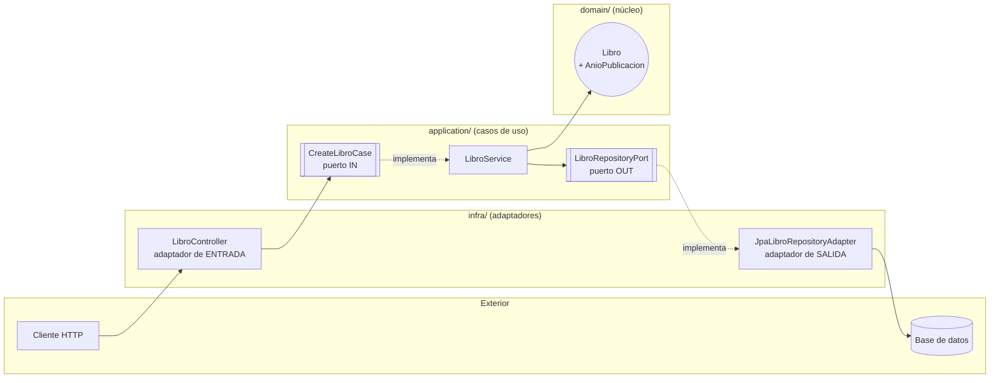

# 📚 apis-0.0.1 — Arquitectura Hexagonal (Puertos y Adaptadores)

Este proyecto Spring Boot está organizado siguiendo **arquitectura hexagonal**. Este README explica la metodología paso a paso usando el módulo `libros` como ejemplo real del propio código.

---

## 1. La idea en una frase

> El **dominio** (tu lógica de negocio) no debe saber que existe Spring, JPA, HTTP o una base de datos. El dominio define **qué necesita** (puertos); el resto del mundo provee **cómo se hace** (adaptadores).

Regla de oro: **las dependencias siempre apuntan hacia el dominio, nunca al revés.**



---

## 2. Las capas y sus reglas

| Capa | Carpeta | Contiene | Depende de |
|---|---|---|---|
| **Dominio** | `domain/models/` | Entidades y Value Objects puros, con sus invariantes de negocio | Nada (ni Spring, ni JPA) |
| **Aplicación — puertos** | `application/port/in/` | Interfaces: *qué casos de uso ofrece la app* | Solo del dominio |
| **Aplicación — puertos** | `application/port/out/` | Interfaces: *qué necesita la app del exterior* | Solo del dominio |
| **Aplicación — servicios** | `application/service/` | Implementa los `port/in`, orquesta la lógica usando los `port/out` | Puertos + dominio |
| **Infraestructura — entrada** | `infra/controller/` | Adaptadores que traducen HTTP → llamadas a un `port/in` | Puertos + dominio |
| **Infraestructura — salida** | `infra/persistencie/` | Adaptadores que implementan un `port/out` (JPA, APIs externas, etc.) | Puertos + dominio |
| **DTOs** | `controller/dto/` | Objetos planos para request/response HTTP (nunca cruzan al dominio) | Nada |

**Nunca** debe haber un `import` desde `domain/` o `application/` hacia `infra/`. Si eso pasa, algo está mal ubicado.

---

## 3. Paso a paso: cómo se construyó el módulo `libros`

### Paso 1 — Modelar el dominio con sus reglas de negocio

Empieza siempre aquí, sin pensar en base de datos ni en HTTP.

```java
// domain/models/Libro.java
public record Libro(UUID id, String titulo, String autor, AnioPublicacion anio) {
    public Libro {
        if (titulo == null || titulo.isBlank())
            throw new IllegalArgumentException("El título no puede estar vacío");
        if (autor == null || autor.isBlank())
            throw new IllegalArgumentException("El autor no puede estar vacío");
        if (anio == null)
            throw new IllegalArgumentException("El año de publicación es obligatorio");
    }
}
```

Si un concepto tiene sus propias reglas (no solo "es un número"), sácalo a un **Value Object** en vez de dejarlo como primitivo suelto:

```java
// domain/models/AnioPublicacion.java
@Value
public class AnioPublicacion {
    private final int anio;

    public AnioPublicacion(int anio) {
        if (anio < 0 || anio > Year.now().getValue())
            throw new IllegalArgumentException("El año de publicación no es válido");
        this.anio = anio;
    }
}
```

Beneficio: es **imposible** que exista un `Libro` inválido en cualquier parte del sistema — la validación corre una sola vez, en el constructor, sin importar quién lo cree.

### Paso 2 — Definir el puerto de entrada (qué caso de uso ofreces)

```java
// application/port/in/CreateLibroCase.java
public interface CreateLibroCase {
    Libro createLibro(Libro libro);
}
```

Es el contrato con el que "el exterior" habla con tu aplicación. Un nombre por caso de uso (`CreateLibroCase`, `GetUserCase`, `UpdateUserCase`...), no una interfaz gigante tipo CRUD genérico.

### Paso 3 — Definir el puerto de salida (qué necesitas del exterior)

```java
// application/port/out/LibroRepositoryPort.java
public interface LibroRepositoryPort {
    Libro save(Libro libro);
}
```

No dice "JPA" ni "Postgres". Solo dice "necesito guardar esto y que me devuelvas el resultado".

### Paso 4 — Implementar el servicio (el caso de uso real)

```java
// application/service/LibroService.java
@Service
public class LibroService implements CreateLibroCase {
    private final LibroRepositoryPort libroRepositoryPort;

    public LibroService(LibroRepositoryPort libroRepositoryPort) {
        this.libroRepositoryPort = libroRepositoryPort;
    }

    @Override
    public Libro createLibro(Libro libro) {
        return libroRepositoryPort.save(libro);
    }
}
```

Implementa el puerto `in` y depende del puerto `out` — **nunca** de `JpaLibroRepositoryAdapter` directamente.

### Paso 5 — Implementar el adaptador de salida

```java
// infra/persistencie/JpaLibroRepositoryAdapter.java
@Repository
public class JpaLibroRepositoryAdapter implements LibroRepositoryPort {
    private final SpringDataLibroRepository springDataLibroRepository;

    @Override
    public Libro save(Libro libro) {
        LibroEntity entity = new LibroEntity(libro.id(), libro.titulo(), libro.autor(), libro.anio().getAnio());
        LibroEntity saved = springDataLibroRepository.save(entity);
        return new Libro(saved.getId(), saved.getTitulo(), saved.getAutor(), new AnioPublicacion(saved.getAnioPublicacion()));
    }
}
```

Aquí, y solo aquí, se traduce entre `Libro` (dominio) y `LibroEntity` (persistencia con anotaciones JPA). El resto de la app nunca ve `LibroEntity`.

### Paso 6 — Implementar el adaptador de entrada

```java
// infra/controller/LibroController.java
@RestController
@RequestMapping("/libros")
public class LibroController {
    private final CreateLibroCase createLibroCase;

    @PostMapping
    public LibroResponse createLibro(@RequestBody LibroRequest libro) {
        var libroDomain = new Libro(null, libro.titulo(), libro.autor(), new AnioPublicacion(libro.anio()));
        var creado = createLibroCase.createLibro(libroDomain);
        return new LibroResponse(creado.id().toString(), creado.titulo(), creado.autor(), creado.anio().getAnio());
    }
}
```

Traduce HTTP ↔ dominio usando DTOs (`LibroRequest`/`LibroResponse`) y depende del **puerto** `CreateLibroCase`, no de `LibroService`.

### Paso 7 — Dejar que Spring conecte todo

Como `LibroService implements CreateLibroCase` y `JpaLibroRepositoryAdapter implements LibroRepositoryPort`, la inyección de dependencias de Spring arma el grafo solo: el `Controller` pide un `CreateLibroCase` por el constructor y recibe el `Service`; el `Service` pide un `LibroRepositoryPort` y recibe el `Adapter`. Nadie importa una clase concreta de otra capa, solo interfaces.

---

## 4. Checklist para agregar un módulo nuevo

- [ ] `domain/models/` — crea la entidad/Value Object con sus invariantes en el constructor.
- [ ] `application/port/in/` — una interfaz por caso de uso (`CreateXCase`, `GetXCase`, ...).
- [ ] `application/port/out/` — interfaz de lo que necesitas del exterior (repositorio, cliente HTTP, etc.).
- [ ] `application/service/` — implementa los `port/in`, inyecta los `port/out`.
- [ ] `infra/persistencie/` (o el adaptador que corresponda) — implementa el `port/out`.
- [ ] `infra/controller/` — implementa el adaptador de entrada, usando DTOs propios.
- [ ] Verifica que nada en `domain/` o `application/` importe algo de `infra/`.

---

## 5. Por qué vale la pena

- **Testeabilidad**: puedes testear `LibroService` mockeando `LibroRepositoryPort`, sin levantar base de datos.
- **Reemplazable**: cambiar de JPA a MongoDB, o de REST a GraphQL, solo toca `infra/` — el dominio y los casos de uso no se enteran.
- **Reglas de negocio centralizadas**: la validación vive una sola vez en el dominio, no repetida en cada controller o adapter.

---

## 6. Estructura de carpetas de referencia

```
src/main/java/com/exagonal001/
└── libros/
    ├── domain/models/          → Libro, AnioPublicacion
    ├── application/
    │   ├── port/in/             → CreateLibroCase
    │   ├── port/out/            → LibroRepositoryPort
    │   └── service/              → LibroService
    ├── controller/dto/          → LibroRequest, LibroResponse
    └── infra/
        ├── controller/           → LibroController
        ├── models/                → LibroEntity (JPA)
        └── persistencie/          → SpringDataLibroRepository, JpaLibroRepositoryAdapter
```
